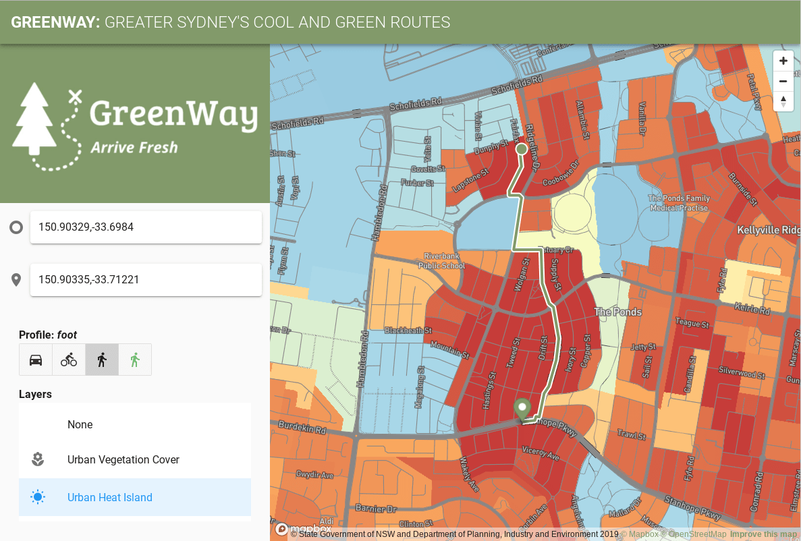
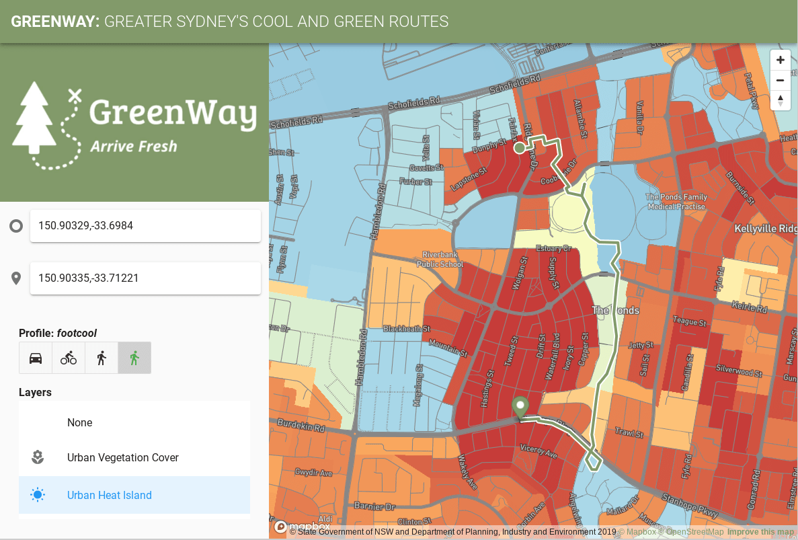

# Greenway

GovHack 2019 Entry - Greater Sydney's Cool and Green Routes - https://hackerspace.govhack.org/projects/greenway

### Normal Pedestrian Routing
The shortest route, but goes through an urbarn heat island.

### Cool Pedestrian Routing
The longer route, but bypassed an urban heat island.

## Implementation

## Front End Web App
Built using Vue/Vuetify, inside `www` run:

- yarn install
- yarn run serve

## Routing Engine

- Implementing using OSRM we have tweaking the pedestrian routing profile in [`profiles/footcool.lua`](https://github.com/andrewharvey/govhack19-greenway/blob/0325a147f72b8a34a28dd02b8ed314328d0b973b/profiles/footcool.lua#L275-L294).
- Using a raster dataset of the NSW Urban Heat Island dataset - https://datasets.seed.nsw.gov.au/dataset/nsw-urban-heat-island-to-modified-mesh-block-2016. This is loaded into the profile the same way as a terrain is loaded in to avoid hilly routes.

## Data Processing

All the scripts are in the `Makefile`, including:
- Build OSRM routing data
- Process SEED open data into Vector Tiles for visualisation in the web app.
